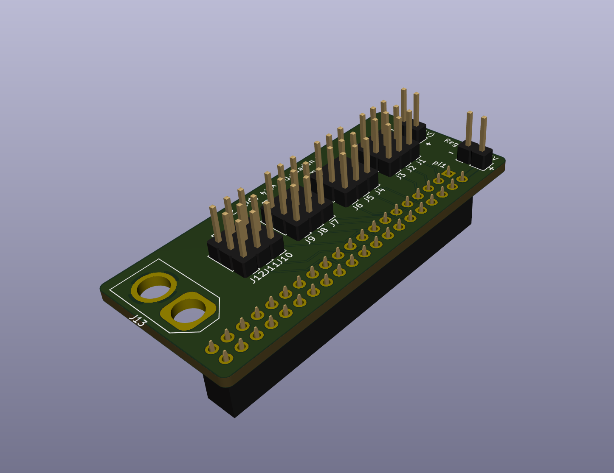

# Pupper Power Distribution Board for Raspberry Pi
This is a custom power distribution board for the versions of Pupper that generate PWM signals from the Raspberry Pi. 

Don't know what Pupper is? It's a cheap dynamics quadruped robot that you can build at home.
- Check out the [Project Page](https://stanfordstudentrobotics.org/pupper)
- Check out the [Code](https://github.com/stanfordroboticsclub/stanfordquadruped)

## Fabrication
1. Upload Gerbers.zip (in this directory) to the quoting mechanism on jlcpcb.com
2. It'll then give you some options on how you want the pcb made
3. Make sure you specify 2oz copper to support the high current from the servos.
4. You can leave everything else as default!

